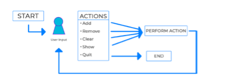

# List of Python Scripts in this repositary

### 1. Creating a Receipt Printing Program

- The script is of very basic  receipt of printing program with variables, operators, and string manipulation
- Below is the screenshot of the output
- 

### 2. Creating a Shopping Cart

- This is an application that stores products within a list. We’ll be able to add, remove, clear, and show the products in the cart. 
- Here is the logical design 

### 3. Creating a User Database with CSV Files

- Building a replica of a user database with CSV files. We’ll be able to take input and allow users to log in/log out/register.
- There are three main parts to this program, registering a user, logging a user in, and the main loop that will run the program. Knowing that the first two are tasks, we can make functions out of them and call them when necessary in the main loop. 

### 4. Creating a BlackJack game

- This script is all about how to use classes in Python to improve our  programs. 

- Throughout the program, and you’ll be able to see how we are able to structure a full-fledged object-oriented game in Python.

- Before going into the program, understanding basic rules of this game is necessary.

  Here is the [link](https://www.youtube.com/watch?v=qd5oc9hLrXg)

  

### 5. Scraping Hacker news based on points

- This program helps us to be updated with latest news in the hacker news, where the up-to-date news about techies using their coding skills in their projects by thresholding the points i.e., similar to likes in Youtube and Facebook

  
